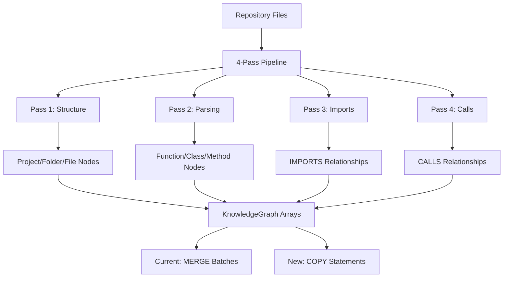

# KuzuDB COPY Implementation - Detailed Technical Plan

> **Reference**: This plan is based on the proven COPY approach documented in [KUZU_COPY_IMPLEMENTATION_GUIDE.md](./KUZU_COPY_IMPLEMENTATION_GUIDE.md) and deep analysis of GitNexus's 4-pass ingestion pipeline.

## Executive Summary

**Objective**: Replace current MERGE-based batch operations with COPY statements for 5-10x performance improvement  
**Status**: ✅ COPY approach proven working in browser tests  
**Strategy**: Polymorphic CSV generation with schema-aware mapping and graceful fallback  

## Deep Architecture Analysis

### Current GitNexus Data Flow



### Node Type Polymorphism Analysis

**16 Node Types** with varying schemas:
- **Structural**: `Project`, `Folder`, `File`, `Package`, `Module` 
- **Code Elements**: `Function`, `Class`, `Method`, `Variable`, `Interface`, `Type`, `Enum`
- **Metadata**: `Import`, `Decorator`, `CodeElement`

**12 Relationship Types** with different connection patterns:
- **Hierarchical**: `CONTAINS`, `BELONGS_TO`
- **Behavioral**: `CALLS`, `USES`, `ACCESSES`  
- **Structural**: `DEFINES`, `IMPORTS`, `IMPLEMENTS`, `EXTENDS`, `INHERITS`, `OVERRIDES`, `DECORATES`

## Implementation Plan

### Phase 1: CSV Generator Service

**File**: `src/core/kuzu/csv-generator.ts`

#### 1.1 Core CSV Generator Class

```typescript
export class GitNexusCSVGenerator {
  private static readonly CSV_ESCAPE_REGEX = /[",\r\n]/;
  private static readonly QUOTE_ESCAPE_REGEX = /"/g;
  
  /**
   * Generate CSV for nodes of specific label with schema-aware column mapping
   */
  static generateNodeCSV(nodes: GraphNode[], label: NodeLabel): string {
    const filteredNodes = nodes.filter(node => node.label === label);
    if (filteredNodes.length === 0) return '';
    
    // Get schema-defined columns for this node type
    const schemaColumns = this.getSchemaColumnsForLabel(label);
    const dynamicColumns = this.extractDynamicColumns(filteredNodes);
    const allColumns = [...schemaColumns, ...dynamicColumns];
    
    // Generate header
    const header = allColumns.join(',');
    
    // Generate rows with proper type conversion
    const rows = filteredNodes.map(node => {
      return allColumns.map(col => {
        const value = col === 'id' ? node.id : node.properties[col];
        return this.formatValueForCSV(value, col, label);
      }).join(',');
    });
    
    return [header, ...rows].join('\n');
  }
  
  /**
   * Generate CSV for relationships with polymorphic property handling
   */
  static generateRelationshipCSV(relationships: GraphRelationship[], type: RelationshipType): string {
    const filteredRels = relationships.filter(rel => rel.type === type);
    if (filteredRels.length === 0) return '';
    
    // Base columns for all relationships
    const baseColumns = ['source', 'target'];
    const schemaColumns = this.getSchemaColumnsForRelType(type);
    const dynamicColumns = this.extractDynamicRelColumns(filteredRels);
    const allColumns = [...baseColumns, ...schemaColumns, ...dynamicColumns];
    
    const header = allColumns.join(',');
    
    const rows = filteredRels.map(rel => {
      return allColumns.map(col => {
        let value: any;
        if (col === 'source') value = rel.source;
        else if (col === 'target') value = rel.target;
        else value = rel.properties[col];
        
        return this.formatValueForCSV(value, col, type);
      }).join(',');
    });
    
    return [header, ...rows].join('\n');
  }
  
  /**
   * Schema-aware value formatting with type conversion
   */
  private static formatValueForCSV(value: any, column: string, entityType: NodeLabel | RelationshipType): string {
    if (value === null || value === undefined) return '';
    
    // Handle arrays (convert to JSON string)
    if (Array.isArray(value)) {
      const arrayStr = JSON.stringify(value);
      return this.escapeCSVValue(arrayStr);
    }
    
    // Handle objects (convert to JSON string)
    if (typeof value === 'object') {
      const objStr = JSON.stringify(value);
      return this.escapeCSVValue(objStr);
    }
    
    // Handle booleans
    if (typeof value === 'boolean') {
      return value ? 'true' : 'false';
    }
    
    // Handle numbers
    if (typeof value === 'number') {
      return String(value);
    }
    
    // Handle strings
    const str = String(value);
    return this.escapeCSVValue(str);
  }
  
  /**
   * Proper CSV escaping according to RFC 4180
   */
  private static escapeCSVValue(str: string): string {
    if (!this.CSV_ESCAPE_REGEX.test(str)) {
      return str;
    }
    
    // Escape quotes by doubling them and wrap in quotes
    const escaped = str.replace(this.QUOTE_ESCAPE_REGEX, '""');
    return `"${escaped}"`;
  }
  
  /**
   * Get schema-defined columns for node label
   */
  private static getSchemaColumnsForLabel(label: NodeLabel): string[] {
    const schema = NODE_TABLE_SCHEMAS[label];
    return schema ? Object.keys(schema).filter(col => col !== 'id') : [];
  }
  
  /**
   * Get schema-defined columns for relationship type  
   */
  private static getSchemaColumnsForRelType(type: RelationshipType): string[] {
    const relDef = RELATIONSHIP_TABLE_SCHEMAS.find(def => def.name === type);
    return relDef ? Object.keys(relDef.schema) : [];
  }
  
  /**
   * Extract dynamic columns not in schema (for flexibility)
   */
  private static extractDynamicColumns(nodes: GraphNode[]): string[] {
    const schemaColumns = new Set(this.getSchemaColumnsForLabel(nodes[0]?.label));
    const dynamicColumns = new Set<string>();
    
    nodes.forEach(node => {
      Object.keys(node.properties).forEach(key => {
        if (!schemaColumns.has(key)) {
          dynamicColumns.add(key);
        }
      });
    });
    
    return Array.from(dynamicColumns).sort();
  }
  
  /**
   * Extract dynamic columns for relationships
   */
  private static extractDynamicRelColumns(relationships: GraphRelationship[]): string[] {
    const schemaColumns = new Set(this.getSchemaColumnsForRelType(relationships[0]?.type));
    const dynamicColumns = new Set<string>();
    
    relationships.forEach(rel => {
      Object.keys(rel.properties).forEach(key => {
        if (!schemaColumns.has(key)) {
          dynamicColumns.add(key);
        }
      });
    });
    
    return Array.from(dynamicColumns).sort();
  }
}
```

#### 1.2 Schema Integration

**Import required schemas**:
```typescript
import { NODE_TABLE_SCHEMAS, RELATIONSHIP_TABLE_SCHEMAS } from './kuzu-schema.ts';
import type { NodeLabel, RelationshipType } from '../graph/types.ts';
```

### Phase 2: Enhanced KuzuKnowledgeGraph

**File**: `src/core/graph/kuzu-knowledge-graph.ts`

#### 2.1 Add COPY-based Methods

**Insert after line 196** (current `commitNodesBatch` method):

```typescript
/**
 * Commit nodes using COPY statement (new optimized approach)
 */
private async commitNodesBatchWithCOPY(label: string, nodes: GraphNode[]): Promise<void> {
  if (nodes.length === 0) return;
  
  try {
    console.log(`🚀 COPY: Starting COPY-based commit of ${nodes.length} ${label} nodes`);
    
    // Generate CSV data
    const csvData = GitNexusCSVGenerator.generateNodeCSV(nodes, label as NodeLabel);
    if (!csvData) {
      console.warn(`⚠️ No CSV data generated for ${label} nodes`);
      return;
    }
    
    // Write to WASM filesystem with unique filename
    const timestamp = Date.now();
    const csvPath = `/temp_${label}_nodes_${timestamp}.csv`;
    
    // Access FS API through query engine
    const kuzuFS = await this.getKuzuFS();
    await kuzuFS.writeFile(csvPath, csvData);
    
    console.log(`📝 Written ${csvData.length} bytes to ${csvPath}`);
    
    // Execute COPY statement
    const copyQuery = `COPY ${label} FROM '${csvPath}'`;
    const result = await this.queryEngine.executeQuery(copyQuery);
    await result.close();
    
    console.log(`✅ COPY: Successfully loaded ${nodes.length} ${label} nodes via COPY`);
    
    // Optional: Clean up temp file (WASM filesystem is in-memory, so not critical)
    try {
      // Note: KuzuDB WASM might not have unlink, that's OK
      // await kuzuFS.unlink?.(csvPath);
    } catch (cleanupError) {
      // Ignore cleanup errors
    }
    
  } catch (error) {
    console.error(`❌ COPY failed for ${label} nodes:`, error);
    throw error;
  }
}

/**
 * Commit relationships using COPY statement (new optimized approach)
 */
private async commitRelationshipsBatchWithCOPY(type: string, relationships: GraphRelationship[]): Promise<void> {
  if (relationships.length === 0) return;
  
  try {
    console.log(`🚀 COPY: Starting COPY-based commit of ${relationships.length} ${type} relationships`);
    
    // Generate CSV data
    const csvData = GitNexusCSVGenerator.generateRelationshipCSV(relationships, type as RelationshipType);
    if (!csvData) {
      console.warn(`⚠️ No CSV data generated for ${type} relationships`);
      return;
    }
    
    // Write to WASM filesystem
    const timestamp = Date.now();
    const csvPath = `/temp_${type}_rels_${timestamp}.csv`;
    
    const kuzuFS = await this.getKuzuFS();
    await kuzuFS.writeFile(csvPath, csvData);
    
    console.log(`📝 Written ${csvData.length} bytes to ${csvPath}`);
    
    // Execute COPY statement
    const copyQuery = `COPY ${type} FROM '${csvPath}'`;
    const result = await this.queryEngine.executeQuery(copyQuery);
    await result.close();
    
    console.log(`✅ COPY: Successfully loaded ${relationships.length} ${type} relationships via COPY`);
    
  } catch (error) {
    console.error(`❌ COPY failed for ${type} relationships:`, error);
    throw error;
  }
}

/**
 * Get access to KuzuDB FS API
 */
private async getKuzuFS(): Promise<any> {
  // Access FS through the query engine's kuzu instance
  const kuzuInstance = await this.queryEngine.getKuzuInstance();
  const fs = kuzuInstance.getFS();
  
  if (!fs || !fs.writeFile) {
    throw new Error('KuzuDB FS API not available');
  }
  
  return fs;
}
```

#### 2.2 Modify Main Batch Methods

**Replace current `commitNodesBatch` method** (around line 199):

```typescript
/**
 * Commit a batch of nodes with COPY optimization and MERGE fallback
 */
private async commitNodesBatch(label: string, nodes: GraphNode[]): Promise<void> {
  if (nodes.length === 0) return;
  
  // Check if COPY is enabled and supported
  if (this.isCopyEnabled() && await this.isCopySupported()) {
    try {
      await this.commitNodesBatchWithCOPY(label, nodes);
      return; // Success with COPY
    } catch (copyError) {
      console.warn(`⚠️ COPY failed for ${label}, falling back to MERGE:`, copyError.message);
      // Fall through to MERGE approach
    }
  }
  
  // Fallback to current MERGE approach
  await this.commitNodesBatchWithMERGE(label, nodes);
}

/**
 * Commit a batch of relationships with COPY optimization and MERGE fallback
 */
private async commitRelationshipsBatch(type: string, relationships: GraphRelationship[]): Promise<void> {
  if (relationships.length === 0) return;
  
  // Check if COPY is enabled and supported
  if (this.isCopyEnabled() && await this.isCopySupported()) {
    try {
      await this.commitRelationshipsBatchWithCOPY(type, relationships);
      return; // Success with COPY
    } catch (copyError) {
      console.warn(`⚠️ COPY failed for ${type}, falling back to MERGE:`, copyError.message);
      // Fall through to MERGE approach
    }
  }
  
  // Fallback to current MERGE approach
  await this.commitRelationshipsBatchWithMERGE(type, relationships);
}
```

#### 2.3 Rename Current Methods for Fallback

**Rename existing methods** to preserve them as fallback:

```typescript
/**
 * Original MERGE-based batch commit (kept as fallback)
 */
private async commitNodesBatchWithMERGE(label: string, nodes: GraphNode[]): Promise<void> {
  // Move existing commitNodesBatch implementation here
  // ... existing MERGE logic ...
}

/**
 * Original MERGE-based relationship commit (kept as fallback)  
 */
private async commitRelationshipsBatchWithMERGE(type: string, relationships: GraphRelationship[]): Promise<void> {
  // Move existing commitRelationshipsBatch implementation here
  // ... existing MERGE logic ...
}
```

#### 2.4 Add Support Detection Methods

```typescript
/**
 * Check if COPY approach is enabled via feature flag
 */
private isCopyEnabled(): boolean {
  return isKuzuCopyEnabled(); // Feature flag function
}

/**
 * Check if COPY approach is supported in current environment
 */
private async isCopySupported(): Promise<boolean> {
  try {
    const kuzuFS = await this.getKuzuFS();
    return !!(kuzuFS && kuzuFS.writeFile);
  } catch (error) {
    return false;
  }
}
```

### Phase 3: KuzuDB Module Enhancement

**File**: `src/core/kuzu/kuzu-npm-integration.ts`

#### 3.1 Expose FS API

**Add to KuzuInstance interface** (around line 206):

```typescript
export interface KuzuInstance {
  // ... existing methods
  
  /**
   * Get access to KuzuDB filesystem API for COPY operations
   */
  getFS(): any;
}
```

**Add to createKuzuInstance function** (around line 212):

```typescript
return {
  // ... existing methods
  
  getFS(): any {
    if (!kuzuModule || !kuzuModule.default || !kuzuModule.default.FS) {
      throw new Error('KuzuDB FS API not available');
    }
    return kuzuModule.default.FS;
  }
};
```

#### 3.2 Add FS API to KuzuQueryEngine

**File**: `src/core/graph/kuzu-query-engine.ts`

**Add method** (around line 680):

```typescript
/**
 * Get KuzuDB instance for direct FS access
 */
async getKuzuInstance(): Promise<KuzuInstance> {
  if (!this.kuzuInstance) {
    throw new Error('KuzuDB not initialized');
  }
  return this.kuzuInstance;
}
```

### Phase 4: Feature Flag Integration

**File**: `src/config/features.ts`

#### 4.1 Add COPY Feature Flag

**Add after existing feature flags** (around line 106):

```typescript
/**
 * Enable KuzuDB COPY-based bulk loading (experimental)
 */
export function isKuzuCopyEnabled(): boolean {
  return cachedConfig?.features.enableKuzuCopy ?? false;
}
```

#### 4.2 Add to Config Schema

**File**: `src/config/config.ts`

**Add to features schema**:

```typescript
const featuresSchema = z.object({
  // ... existing features
  enableKuzuCopy: z.boolean().default(false),
});
```

**Add to default config**:

```typescript
features: {
  // ... existing features
  enableKuzuCopy: false, // Disabled by default for gradual rollout
}
```

### Phase 5: Import Integration

**File**: `src/core/graph/kuzu-knowledge-graph.ts`

**Add import at top**:

```typescript
import { GitNexusCSVGenerator } from '../kuzu/csv-generator.ts';
import { isKuzuCopyEnabled } from '../../config/features.ts';
```

## Data Flow Analysis & Mapping

### Node Type Processing Pipeline

```typescript
// Pass 1: Structure Processor
Project -> CSV: id,name,path,description,version,createdAt
Folder  -> CSV: id,name,path,fullPath,depth  
File    -> CSV: id,name,path,filePath,extension,language,size,definitionCount,lineCount

// Pass 2: Parsing Processor  
Function -> CSV: id,name,filePath,type,startLine,endLine,qualifiedName,parameters,returnType,accessibility,isStatic,isAsync,parentClass,docstring
Class    -> CSV: id,name,filePath,startLine,endLine,qualifiedName,accessibility,isAbstract,extends,implements,docstring
Method   -> CSV: id,name,filePath,startLine,endLine,qualifiedName,parameters,returnType,accessibility,isStatic,isAsync,parentClass,docstring
Variable -> CSV: id,name,filePath,startLine,endLine,type,accessibility,isStatic
Interface-> CSV: id,name,filePath,startLine,endLine,qualifiedName,extends,docstring
Type     -> CSV: id,name,filePath,startLine,endLine,qualifiedName,typeDefinition,docstring
Import   -> CSV: id,name,filePath,type,startLine,endLine,parameters,returnType,accessibility,isStatic,isAsync,parentClass,decorators,extends,implements,importPath,exportType,docstring
Decorator-> CSV: id,name,filePath,startLine,endLine,targetType,arguments
```

### Relationship Type Processing Pipeline

```typescript
// Pass 1: Structure Relationships
CONTAINS -> CSV: source,target (no additional properties)

// Pass 2: Parsing Relationships  
DEFINES -> CSV: source,target,filePath,line_number

// Pass 3: Import Relationships
IMPORTS -> CSV: source,target,importType,localName,exportedName

// Pass 4: Call Relationships
CALLS -> CSV: source,target,callType,functionName,startLine,endLine
```

## Performance Optimization Strategy

### Batch Size Optimization

```typescript
// Current: Fixed 100 items per batch
// Optimized: Dynamic batch sizing based on data size

private calculateOptimalBatchSize(nodes: GraphNode[]): number {
  const avgNodeSize = this.estimateNodeSize(nodes[0]);
  const targetCSVSize = 1024 * 1024; // 1MB target
  return Math.min(Math.max(Math.floor(targetCSVSize / avgNodeSize), 10), 1000);
}

private estimateNodeSize(node: GraphNode): number {
  return JSON.stringify(node).length * 1.2; // CSV overhead factor
}
```

### Memory Management

```typescript
// Stream large CSV generation to avoid memory spikes
private async generateLargeCSV(nodes: GraphNode[], label: NodeLabel): Promise<string> {
  if (nodes.length < 1000) {
    return GitNexusCSVGenerator.generateNodeCSV(nodes, label);
  }
  
  // For large datasets, generate in chunks
  const chunks: string[] = [];
  const chunkSize = 500;
  
  for (let i = 0; i < nodes.length; i += chunkSize) {
    const chunk = nodes.slice(i, i + chunkSize);
    const csvChunk = GitNexusCSVGenerator.generateNodeCSV(chunk, label);
    
    if (i === 0) {
      chunks.push(csvChunk); // Include header
    } else {
      // Skip header for subsequent chunks
      const lines = csvChunk.split('\n');
      chunks.push(lines.slice(1).join('\n'));
    }
  }
  
  return chunks.join('\n');
}
```

## Error Handling & Recovery

### Comprehensive Error Categories

```typescript
enum CopyErrorType {
  FS_NOT_AVAILABLE = 'FS_NOT_AVAILABLE',
  FS_WRITE_FAILED = 'FS_WRITE_FAILED', 
  CSV_GENERATION_FAILED = 'CSV_GENERATION_FAILED',
  COPY_EXECUTION_FAILED = 'COPY_EXECUTION_FAILED',
  SCHEMA_MISMATCH = 'SCHEMA_MISMATCH',
  DATA_FORMAT_ERROR = 'DATA_FORMAT_ERROR'
}

private async handleCopyError(error: Error, errorType: CopyErrorType, context: string): Promise<void> {
  console.error(`❌ COPY Error [${errorType}] in ${context}:`, error.message);
  
  // Log detailed error for debugging
  this.logCopyError(errorType, error, context);
  
  // Increment failure metrics
  this.incrementCopyFailureMetric(errorType);
  
  // Determine if we should retry or fallback
  if (this.shouldRetryAfterError(errorType)) {
    throw error; // Let retry logic handle it
  } else {
    // Fallback to MERGE approach
    throw new Error(`COPY failed, falling back to MERGE: ${error.message}`);
  }
}
```

### Auto-Recovery Mechanisms

```typescript
private async executeWithRetry<T>(
  operation: () => Promise<T>, 
  maxRetries: number = 2,
  context: string
): Promise<T> {
  let lastError: Error;
  
  for (let attempt = 1; attempt <= maxRetries; attempt++) {
    try {
      return await operation();
    } catch (error) {
      lastError = error as Error;
      console.warn(`⚠️ COPY attempt ${attempt}/${maxRetries} failed in ${context}:`, error);
      
      if (attempt < maxRetries) {
        // Wait before retry with exponential backoff
        await this.delay(Math.pow(2, attempt) * 100);
      }
    }
  }
  
  throw lastError!;
}
```

## Testing Strategy

### Unit Tests

**File**: `src/__tests__/kuzu-csv-generator.test.ts`

```typescript
describe('GitNexusCSVGenerator', () => {
  describe('generateNodeCSV', () => {
    it('should generate valid CSV for Function nodes', () => {
      const nodes: GraphNode[] = [
        {
          id: 'func_1',
          label: 'Function',
          properties: {
            name: 'testFunction',
            filePath: '/src/test.ts',
            startLine: 10,
            parameters: ['param1', 'param2'],
            returnType: 'string'
          }
        }
      ];
      
      const csv = GitNexusCSVGenerator.generateNodeCSV(nodes, 'Function');
      
      expect(csv).toContain('id,name,filePath');
      expect(csv).toContain('func_1,testFunction,/src/test.ts');
      expect(csv).toContain('"[""param1"",""param2""]"'); // Escaped array
    });
    
    it('should handle special characters in CSV', () => {
      const nodes: GraphNode[] = [
        {
          id: 'test_1', 
          label: 'Function',
          properties: {
            name: 'function,with"quotes',
            docstring: 'Multi\nline\ndocstring'
          }
        }
      ];
      
      const csv = GitNexusCSVGenerator.generateNodeCSV(nodes, 'Function');
      
      expect(csv).toContain('"function,with""quotes"');
      expect(csv).toContain('"Multi\nline\ndocstring"');
    });
  });
});
```

### Integration Tests

**File**: `src/__tests__/kuzu-copy-integration.test.ts`

```typescript
describe('KuzuDB COPY Integration', () => {
  let kuzuGraph: KuzuKnowledgeGraph;
  
  beforeEach(async () => {
    // Setup test KuzuDB instance
    const queryEngine = new KuzuQueryEngine({ databasePath: ':memory:' });
    await queryEngine.initialize();
    kuzuGraph = new KuzuKnowledgeGraph(queryEngine, { batchSize: 10 });
  });
  
  it('should successfully use COPY for node batch loading', async () => {
    const nodes: GraphNode[] = generateTestNodes(50, 'Function');
    
    // Enable COPY for this test
    jest.spyOn(kuzuGraph as any, 'isCopyEnabled').mockReturnValue(true);
    jest.spyOn(kuzuGraph as any, 'isCopySupported').mockResolvedValue(true);
    
    await kuzuGraph.commitNodesBatch('Function', nodes);
    
    // Verify data was loaded
    const result = await kuzuGraph.queryEngine.executeQuery('MATCH (f:Function) RETURN count(f)');
    expect(result.rows[0][0]).toBe(50);
  });
  
  it('should fallback to MERGE when COPY fails', async () => {
    const nodes: GraphNode[] = generateTestNodes(10, 'Function');
    
    // Mock COPY failure
    jest.spyOn(kuzuGraph as any, 'isCopyEnabled').mockReturnValue(true);
    jest.spyOn(kuzuGraph as any, 'isCopySupported').mockResolvedValue(true);
    jest.spyOn(kuzuGraph as any, 'commitNodesBatchWithCOPY').mockRejectedValue(new Error('COPY failed'));
    
    // Should not throw - should fallback to MERGE
    await expect(kuzuGraph.commitNodesBatch('Function', nodes)).resolves.not.toThrow();
  });
});
```

## Deployment Strategy

### Phase 1: Development & Testing (Week 1-2)
- [ ] Implement CSV generator with comprehensive tests
- [ ] Add COPY methods to KuzuKnowledgeGraph
- [ ] Implement FS API access
- [ ] Add feature flag infrastructure
- [ ] Unit and integration testing

### Phase 2: Internal Testing (Week 3)  
- [ ] Deploy with feature flag disabled
- [ ] Enable for internal testing environments
- [ ] Performance benchmarking vs current MERGE approach
- [ ] Error rate monitoring and debugging

### Phase 3: Gradual Rollout (Week 4-5)
- [ ] Enable for 10% of users
- [ ] Monitor performance metrics and error rates  
- [ ] Gradual increase to 50% then 100%
- [ ] Rollback capability via feature flag

### Phase 4: Optimization (Week 6+)
- [ ] Performance tuning based on real-world data
- [ ] Advanced error recovery mechanisms
- [ ] Memory optimization for large repositories
- [ ] Documentation and knowledge transfer

## Success Metrics

### Performance Metrics
- **Ingestion Speed**: Target 5-10x improvement for large repositories (1000+ files)
- **Memory Usage**: Reduce peak memory consumption during batch operations
- **Error Rate**: Maintain <1% COPY failure rate with successful MERGE fallback

### Reliability Metrics  
- **Fallback Success**: 100% successful fallback to MERGE when COPY fails
- **Data Integrity**: Zero data loss during COPY operations
- **Browser Compatibility**: Support across Chrome, Firefox, Safari, Edge

### Adoption Metrics
- **Feature Flag Rollout**: Successful gradual deployment to 100% of users
- **User Experience**: No degradation in user-facing functionality
- **Developer Experience**: Seamless integration with existing codebase

## Risk Mitigation

### Technical Risks
1. **COPY Statement Failures**: Comprehensive fallback to MERGE approach
2. **FS API Unavailability**: Environment detection and graceful degradation  
3. **Memory Issues**: Chunked processing for large datasets
4. **Browser Compatibility**: Feature detection and progressive enhancement

### Operational Risks
1. **Performance Regression**: Extensive benchmarking and monitoring
2. **Data Corruption**: Comprehensive validation and testing
3. **Deployment Issues**: Feature flag-based rollout with instant rollback capability

This implementation plan provides a comprehensive, step-by-step approach to integrating the proven COPY functionality into GitNexus with full consideration of the existing architecture, polymorphic data structures, and operational requirements.
