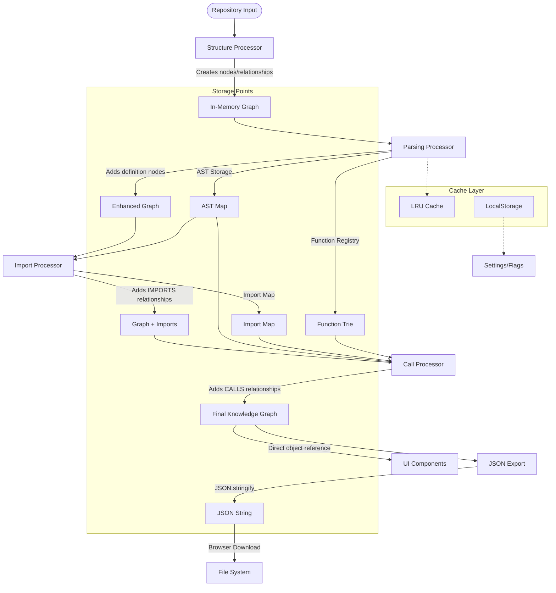

# GitNexus Parsing and Storage Technical Documentation
## Complete Data Flow Analysis for Kuzu DB Migration

> **Purpose**: This document provides an extremely detailed, line-by-line analysis of GitNexus's current parsing and storage implementation to facilitate the migration from JSON-based storage to Kuzu DB.

---

## Executive Summary

GitNexus uses a **4-pass ingestion pipeline** that processes code repositories into a knowledge graph stored in JSON format. The system employs in-memory data structures (`SimpleKnowledgeGraph`) with JSON serialization for persistence. This document traces every step of the data transformation process to enable precise Kuzu DB migration.

### Key Storage Points Identified:
1. **In-Memory Graph Storage**: `SimpleKnowledgeGraph` class with arrays
2. **JSON Export/Import**: Via `src/lib/export.ts` functions
3. **LRU Cache Storage**: For AST and parsing results
4. **LocalStorage**: For settings, feature flags, and chat history
5. **IndexedDB**: Planned for KuzuDB persistence (WIP)

---

## 1. Core Data Structures

### 1.1 Knowledge Graph Structure

**File**: `src/core/graph/types.ts`

```typescript
// Primary graph interface - this is what gets stored
export interface KnowledgeGraph {
  nodes: GraphNode[];           // Array of all nodes
  relationships: GraphRelationship[];  // Array of all relationships
}

// Node structure - every entity in the system
export interface GraphNode {
  id: string;                   // Unique identifier (generated)
  label: NodeLabel;             // Type classification
  properties: NodeProperties;   // All metadata as key-value pairs
}

// Relationship structure - connections between nodes
export interface GraphRelationship {
  id: string;                   // Unique identifier (generated)
  type: RelationshipType;       // Relationship classification
  source: string;               // Source node ID
  target: string;               // Target node ID  
  properties: RelationshipProperties; // Metadata as key-value pairs
}
```

**Node Types** (`NodeLabel`):
- `'Project'` - Repository root
- `'Folder'` - Directory nodes
- `'File'` - Source files
- `'Function'` - Function definitions
- `'Class'` - Class definitions
- `'Method'` - Class methods
- `'Variable'` - Variable declarations
- `'Interface'` - TypeScript interfaces
- `'Decorator'` - Python/TS decorators
- `'Import'` - Import statements
- `'Type'` - Type definitions
- `'CodeElement'` - Generic code elements

**Relationship Types** (`RelationshipType`):
- `'CONTAINS'` - Hierarchical containment (folder → file, file → function)
- `'CALLS'` - Function/method calls
- `'INHERITS'` - Class inheritance
- `'OVERRIDES'` - Method overrides
- `'IMPORTS'` - Module imports
- `'IMPLEMENTS'` - Interface implementations
- `'DECORATES'` - Decorator applications

### 1.2 Implementation Class

**File**: `src/core/graph/graph.ts`

```typescript
export class SimpleKnowledgeGraph implements KnowledgeGraph {
  nodes: GraphNode[] = [];              // Simple array storage
  relationships: GraphRelationship[] = []; // Simple array storage

  addNode(node: GraphNode): void {
    this.nodes.push(node);              // Direct array append
  }

  addRelationship(relationship: GraphRelationship): void {
    this.relationships.push(relationship); // Direct array append
  }
}
```

**Critical Storage Characteristics**:
- **No indexing**: Linear search for node/relationship lookups
- **No constraints**: No validation of referential integrity
- **Memory-only**: No built-in persistence
- **Simple append**: No deduplication or conflict resolution

---

## 2. Four-Pass Ingestion Pipeline

The pipeline transforms raw repository data through four distinct phases, each building upon the previous:

### Pass 1: Structure Analysis (`StructureProcessor`)

**File**: `src/core/ingestion/structure-processor.ts`

**Input**: 
- `projectRoot: string` - Repository path
- `projectName: string` - Repository name  
- `filePaths: string[]` - All discovered file paths

**Process**:
1. **Project Node Creation** (Lines 58-61):
   ```typescript
   const projectNode = this.createProjectNode(projectName, projectRoot);
   graph.addNode(projectNode);  // STORAGE POINT 1
   ```

2. **Path Categorization** (Lines 87-127):
   ```typescript
   const { directories, files } = this.categorizePaths(filePaths);
   // Separates files from directories using path analysis
   ```

3. **Directory Node Creation** (Lines 147-174):
   ```typescript
   const directoryNodes = this.createDirectoryNodes(visibleDirectories);
   directoryNodes.forEach(node => graph.addNode(node)); // STORAGE POINT 2
   ```

4. **File Node Creation** (Lines 179-208):
   ```typescript
   const fileNodes = this.createFileNodes(visibleFiles);
   fileNodes.forEach(node => graph.addNode(node)); // STORAGE POINT 3
   ```

5. **CONTAINS Relationship Creation** (Lines 213-255):
   ```typescript
   this.createContainsRelationships(graph, projectNode.id, visibleDirectories, visibleFiles);
   // Creates hierarchical relationships - STORAGE POINT 4
   ```

**Storage Pattern**: Direct `graph.addNode()` and `graph.addRelationship()` calls append to arrays.

### Pass 2: Code Parsing (`ParsingProcessor` / `ParallelParsingProcessor`)

**Files**: 
- `src/core/ingestion/parsing-processor.ts`
- `src/core/ingestion/parallel-parsing-processor.ts`

**Input**:
- `filePaths: string[]` - Files to parse
- `fileContents: Map<string, string>` - File content mapping
- `options?: ParsingOptions` - Filtering options

**Critical Data Structures**:

1. **AST Storage** (Line 55 in `parsing-processor.ts`):
   ```typescript
   private astMap: Map<string, ParsedAST> = new Map();
   // STORAGE POINT 5 - AST trees indexed by file path
   ```

2. **Function Registry** (Line 56):
   ```typescript
   private functionTrie: FunctionRegistryTrie = new FunctionRegistryTrie();
   // STORAGE POINT 6 - Searchable function definitions
   ```

**Process Flow**:

1. **File Filtering** (Lines 116-152):
   ```typescript
   const filteredFiles = this.applyFiltering(filePaths, fileContents, options);
   // Applies directory and extension filters
   ```

2. **Tree-sitter Initialization** (Lines 84, 245):
   ```typescript
   await this.initializeParser();
   // Loads WASM parsers for each language
   ```

3. **Batch Processing** (Lines 86-108):
   ```typescript
   const batchProcessor = new BatchProcessor<string, void>(BATCH_SIZE, async (filePaths: string[]) => {
     for (const filePath of filePaths) {
       await this.parseFile(graph, filePath, content); // CRITICAL PARSING
       this.processedFiles.add(filePath);
     }
   });
   ```

4. **Definition Extraction** (`parseFile` method):
   ```typescript
   // Extracts: functions, classes, methods, variables, interfaces, types
   // Each creates nodes via: graph.addNode(definitionNode) - STORAGE POINT 7
   ```

**Parallel Processing Variant**:
- Uses Web Workers for CPU-intensive parsing
- Results aggregated in main thread
- Same storage patterns but with worker coordination

### Pass 3: Import Resolution (`ImportProcessor`)

**File**: `src/core/ingestion/import-processor.ts`

**Input**:
- `graph: KnowledgeGraph` - Current graph state
- `astMap: Map<string, ParsedAST>` - Parsed ASTs
- `fileContents: Map<string, string>` - File contents

**Critical Data Structure**:
```typescript
interface ImportMap {
  [importingFile: string]: {
    [localName: string]: {
      targetFile: string;
      exportedName: string;
      importType: 'default' | 'named' | 'namespace' | 'dynamic';
    }
  }
}
private importMap: ImportMap = {}; // STORAGE POINT 8
```

**Process Flow**:

1. **Import Extraction** (Lines 84-88):
   ```typescript
   for (const [filePath, ast] of astMap) {
     const fileImports = await this.processFileImports(filePath, ast, graph);
     // Extracts import statements from AST
   }
   ```

2. **Language-Specific Processing**:
   - **JavaScript/TypeScript** (Lines 231-324): Handles ES6 imports, CommonJS requires
   - **Python** (Lines 160-226): Handles `import` and `from...import` statements

3. **Module Path Resolution** (Lines 522-606):
   ```typescript
   private resolveModulePath(moduleName: string, importingFile: string, language: string): string
   // Resolves relative and absolute imports to actual file paths
   ```

4. **Relationship Creation** (Lines 611-645):
   ```typescript
   private createImportRelationship(graph: KnowledgeGraph, importInfo: ImportInfo): void {
     // Creates IMPORTS relationships - STORAGE POINT 9
     graph.relationships.push(relationship);
   }
   ```

### Pass 4: Call Resolution (`CallProcessor`)

**File**: `src/core/ingestion/call-processor.ts`

**Input**:
- `graph: KnowledgeGraph` - Current graph
- `astMap: Map<string, ParsedAST>` - ASTs for call extraction
- `importMap: ImportMap` - Import resolution data

**Process Flow**:

1. **Call Extraction** (Lines 86-120):
   ```typescript
   private async processFileCalls(filePath: string, ast: ParsedAST, graph: KnowledgeGraph) {
     const calls = this.extractFunctionCalls(ast.tree!.rootNode, filePath);
     // Extracts function/method call sites from AST
   }
   ```

2. **3-Stage Resolution Strategy** (Lines 146-162):
   ```typescript
   // Stage 1: Exact Match using ImportMap (High Confidence)
   // Stage 2: Same-Module Match (Medium Confidence)  
   // Stage 3: Heuristic Fallback (Low Confidence)
   ```

3. **Call Relationship Creation** (Lines 99-101):
   ```typescript
   if (resolution.success && resolution.targetNodeId) {
     this.createCallRelationship(graph, call, resolution.targetNodeId);
     // Creates CALLS relationships - STORAGE POINT 10
   }
   ```

---

## 3. JSON Storage Implementation

### 3.1 Export Functions

**File**: `src/lib/export.ts`

**Primary Export Function** (Lines 34-68):
```typescript
export function exportGraphToJSON(
  graph: KnowledgeGraph,
  options: ExportOptions = {},
  fileContents?: Map<string, string>,
  processingStats?: { duration: number }
): string {
  
  // Metadata wrapper structure
  if (includeMetadata) {
    const metadata: ExportMetadata = {
      exportedAt: includeTimestamp ? new Date().toISOString() : '',
      version: '1.0.0',
      nodeCount: graph.nodes.length,
      relationshipCount: graph.relationships.length,
      fileCount: fileContents?.size,
      processingDuration: processingStats?.duration
    };

    exportData = {
      metadata,
      graph,  // CRITICAL: Raw graph object serialization
      ...(fileContents && { fileContents: Object.fromEntries(fileContents) })
    };
  } else {
    exportData = graph; // Direct graph serialization
  }

  return JSON.stringify(exportData, null, prettyPrint ? 2 : 0);
  // STORAGE POINT 11 - JSON string generation
}
```

**JSON Structure**:
```json
{
  "metadata": {
    "exportedAt": "2024-01-01T00:00:00.000Z",
    "version": "1.0.0", 
    "nodeCount": 1250,
    "relationshipCount": 3400,
    "fileCount": 45,
    "processingDuration": 2500
  },
  "graph": {
    "nodes": [
      {
        "id": "node_project_abc123",
        "label": "Project",
        "properties": {
          "name": "MyProject",
          "path": "/path/to/project",
          "createdAt": "2024-01-01T00:00:00.000Z"
        }
      }
      // ... more nodes
    ],
    "relationships": [
      {
        "id": "rel_contains_def456", 
        "type": "CONTAINS",
        "source": "node_project_abc123",
        "target": "node_folder_ghi789",
        "properties": {}
      }
      // ... more relationships
    ]
  },
  "fileContents": {
    "src/main.ts": "export function main() { ... }",
    // ... more file contents
  }
}
```

### 3.2 Import Functions

**Import Function** (Lines 411-443):
```typescript
export function importGraphFromJSON(jsonString: string): {
  graph: KnowledgeGraph;
  metadata?: ExportMetadata;
  fileContents?: Map<string, string>;
} {
  try {
    const parsed = JSON.parse(jsonString); // DESERIALIZATION POINT
    
    if (parsed.metadata && parsed.graph) {
      // Handle wrapped format
      const result = {
        graph: parsed.graph, // Direct object assignment
        metadata: parsed.metadata
      };
      
      if (parsed.fileContents) {
        result.fileContents = new Map(Object.entries(parsed.fileContents));
        // Convert plain object back to Map
      }
      
      return result;
    }
    
    return { graph: parsed }; // Direct graph object
  } catch (error) {
    throw new Error(`Failed to import graph: ${error.message}`);
  }
}
```

### 3.3 Download Implementation

**File Download** (Lines 182-207):
```typescript
export function downloadJSON(content: string, filename: string): void {
  // Create blob with JSON content
  const blob = new Blob([content], { type: 'application/json' });
  
  // Browser download mechanism
  const url = URL.createObjectURL(blob);
  const link = document.createElement('a');
  link.href = url;
  link.download = filename;
  link.click(); // Triggers download - PERSISTENCE POINT
}
```

---

## 4. Additional Storage Mechanisms

### 4.1 LRU Cache Storage

**Files**: 
- `src/services/memory-manager.ts` (Memory management)
- Various processor classes (Cache usage)

**Purpose**: Caches parsed ASTs and query results for performance

**Implementation Pattern**:
```typescript
// Cache key generation
const cacheKey = this.lruCache.generateFileCacheKey(filePath, contentHash);

// Cache retrieval
const cachedResult = this.lruCache.getParsedFile(cacheKey);

// Cache storage  
this.lruCache.setParsedFile(cacheKey, parseResult); // STORAGE POINT 12
```

### 4.2 LocalStorage Usage

**Settings Storage** (`src/config/feature-flags.ts`, Lines 104-110):
```typescript
private saveFlags(): void {
  try {
    localStorage.setItem('gitnexus_feature_flags', JSON.stringify(this.flags));
    // STORAGE POINT 13 - Browser localStorage
  } catch (error) {
    console.warn('Failed to save feature flags to localStorage:', error);
  }
}
```

**Chat History** (`src/lib/chat-history.ts`, Lines 275-291):
```typescript
private saveSession(session: ChatSession): void {
  try {
    localStorage.setItem(this.storageKey, JSON.stringify(session));
    // STORAGE POINT 14 - Chat persistence
  } catch (error) {
    // Handle quota exceeded errors
  }
}
```

### 4.3 IndexedDB (Planned for KuzuDB)

**Current Status**: Implementation exists but not fully integrated
**Files**: `src/core/kuzu/` directory contains KuzuDB integration code
**Purpose**: Will replace JSON storage with embedded graph database

---

## 5. Data Flow Summary



---

## 6. Critical Migration Points for Kuzu DB

### 6.1 Schema Mapping Requirements

**Current JSON Structure → Kuzu Schema**:

1. **Nodes Table**:
   ```sql
   CREATE NODE TABLE IF NOT EXISTS nodes (
     id STRING PRIMARY KEY,
     label STRING NOT NULL,
     properties MAP(STRING, STRING)
   );
   ```

2. **Relationships Table**:
   ```sql
   CREATE REL TABLE IF NOT EXISTS relationships (
     FROM nodes TO nodes,
     id STRING,
     type STRING NOT NULL, 
     properties MAP(STRING, STRING)
   );
   ```

### 6.2 Data Transformation Points

**Every `graph.addNode()` call** → **Kuzu INSERT statement**
**Every `graph.addRelationship()` call** → **Kuzu MATCH/CREATE statement**

### 6.3 Query Transformation Requirements

**Current**: Linear array searches in `SimpleKnowledgeGraph`
**Target**: Cypher queries in KuzuDB

**Example Transformations**:
```typescript
// Current: Find nodes by label
graph.nodes.filter(n => n.label === 'Function')

// Target: Cypher query
MATCH (n:Function) RETURN n
```

### 6.4 Persistence Layer Changes

**Current Flow**:
1. Build `SimpleKnowledgeGraph` in memory
2. Export to JSON string
3. Download as file

**Target Flow**:
1. Stream data directly to KuzuDB during processing
2. Persist to IndexedDB automatically
3. Export via Cypher queries

---

## 7. Implementation Recommendations

### 7.1 Migration Strategy

1. **Phase 1**: Create parallel KuzuDB storage alongside existing JSON
2. **Phase 2**: Implement streaming ingestion (write to Kuzu during pipeline)
3. **Phase 3**: Replace SimpleKnowledgeGraph with KuzuDB queries
4. **Phase 4**: Remove JSON export/import (keep as backup option)

### 7.2 Critical Considerations

1. **Referential Integrity**: Kuzu enforces relationships, JSON doesn't
2. **Transaction Boundaries**: Kuzu needs explicit transactions
3. **Query Performance**: Index strategy for common access patterns
4. **Memory Management**: Kuzu handles memory, current system uses manual arrays
5. **Concurrent Access**: Kuzu supports concurrent reads, current system is single-threaded

### 7.3 Testing Strategy

1. **Data Integrity**: Compare JSON export with Kuzu export for identical results
2. **Performance**: Benchmark ingestion and query performance
3. **Memory Usage**: Monitor memory consumption during large repository processing
4. **Error Handling**: Test transaction rollback and recovery scenarios

---

## Conclusion

This document provides the complete technical foundation for migrating GitNexus from JSON-based storage to KuzuDB. Every storage point, data transformation, and persistence mechanism has been identified and documented. The migration should focus on replacing the `SimpleKnowledgeGraph` implementation while maintaining the exact same data structures and relationships in the new KuzuDB schema.
